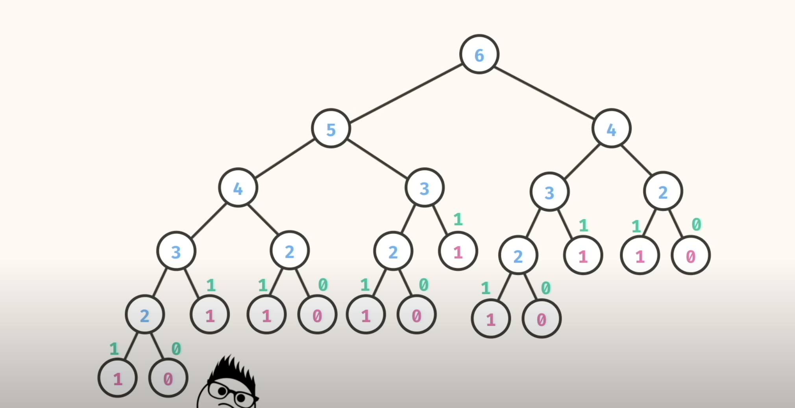

# Dynamic Programming
It's a type of problem solving where we use the overlapping sub-problem
We first solve and store the info the solutionn to the sub-problem because we are likely to
re-encounter it again

1. Fibonacci
0 1 1 2 3 5 8 13 21 .....

Formalize the  problem:
n     : 0 1 2 3 4 5 6 7  8  .....
fib(n): 0 1 1 2 3 5 8 13 21 .....

**Solving the fibonacci recursively**
fib(6) -> 8
fib(6) -> fib(5) + fib(4) 

Every node in the diagram represents a recursive call.
The number of nodes roughly represents the time complexity
*Space complexity for recursion is the number of **stack frames*** we use for our recursion because  whenever we make a recursive call, that information has to be stored in the call stack
 
We use memoization strategy - store info in a hashed data structure (hashmap, dictionary...etcm ). Use a data structure that gives an O(1) lookup time
In recursion, there may be duplication of results. We thus store the results. This is memoization
The keys are usually the changing arguments of your recursion problem.

## DSA
- Java access modifiers are used to provide access control in java. Java provides access control through three keywords - **private, protected and public.** - *We are not required to use these access modifiers always*, so we have another one namely “default access”, “package-private” or “no modifier”.
- Java classes can only use 2 access modifiers:
    1. public
    2. default access: can only be accessed only from other classes in the ***same package***.

### Useful links
1. Access modifiers:
    - https://www.digitalocean.com/community/tutorials/java-access-modifiers
    - 

2. Java is a statically-typed language, which means that the type of a variable is known at compile-time. Assigning a value to a name is referred to as defining a variable. A variable is defined by explicitly specifying its type.
3. A function within a class is referred to as a method. Each method can have zero or more parameters. All parameters must be explicitly typed, there is no type inference for parameters. Similarly, the return type must also be made explicit. Values are returned from methods using the return keyword. To allow a method to be called by other classes, the public access modifier must be added.
4. Use Scanner.hasNext() to read *n* lines of input until you reach EOF
5. Use Scanner.nextLine() to read each line
6. String.valueOf(int) to convert int to str

## Regex Patterns
[abc]	Find one character from the options between the brackets
[^abc]	Find one character NOT between the brackets
[0-9]	Find one character from the range 0 to 9