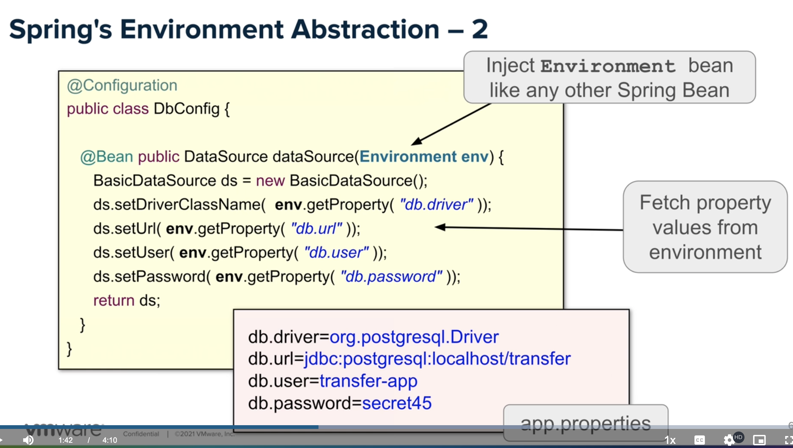
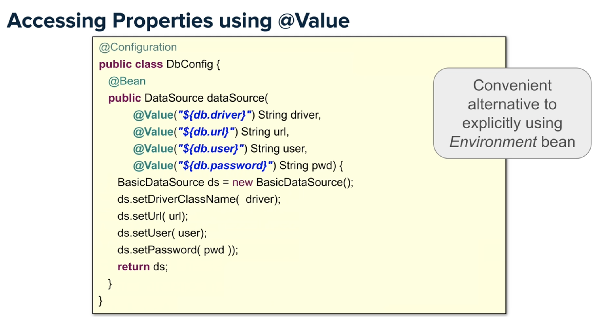
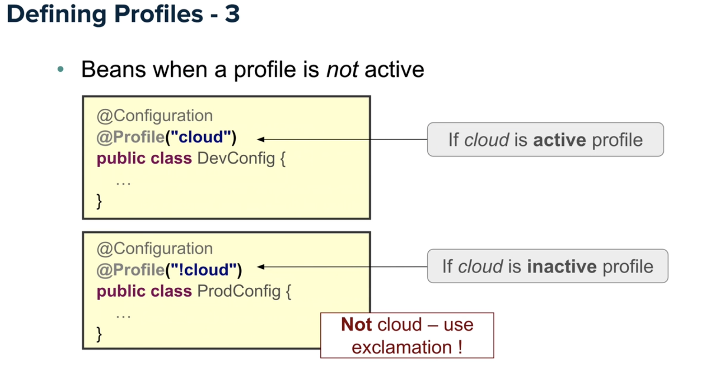
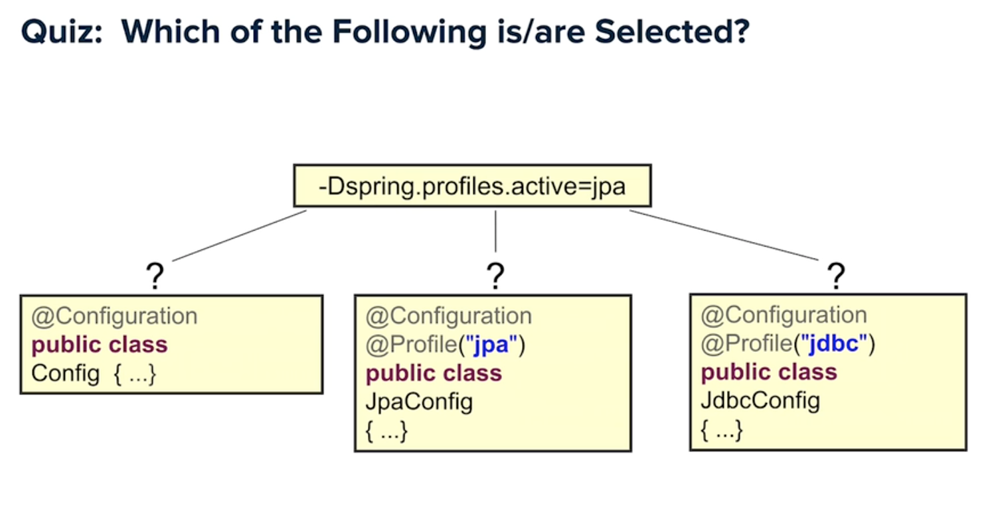
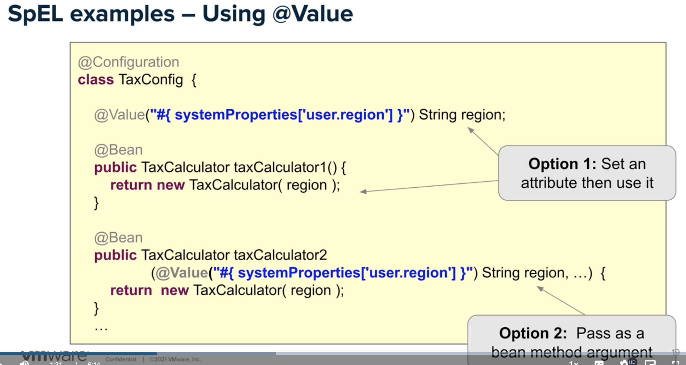
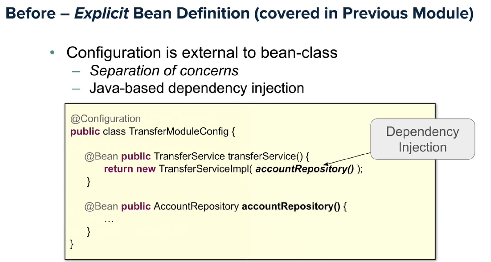
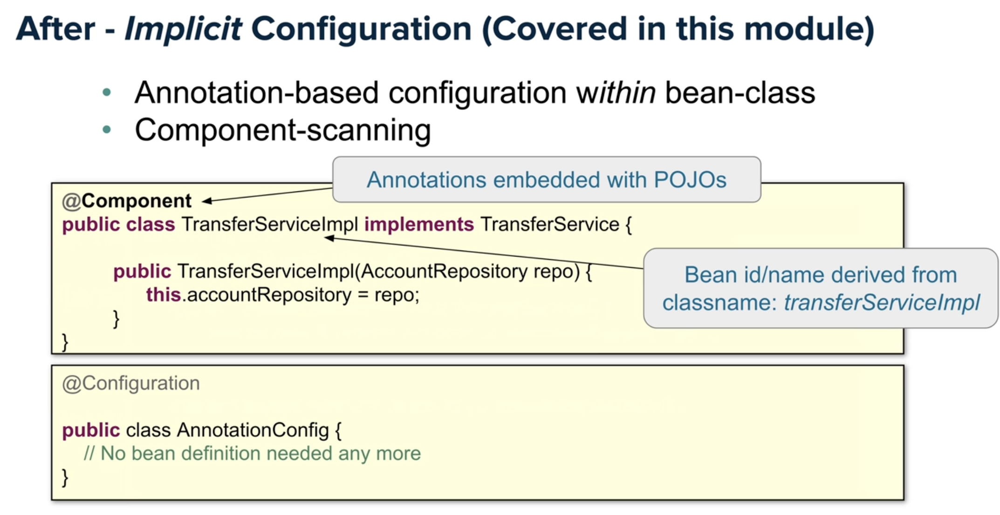
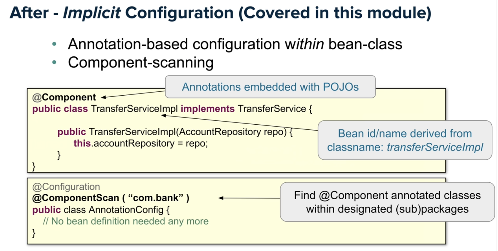
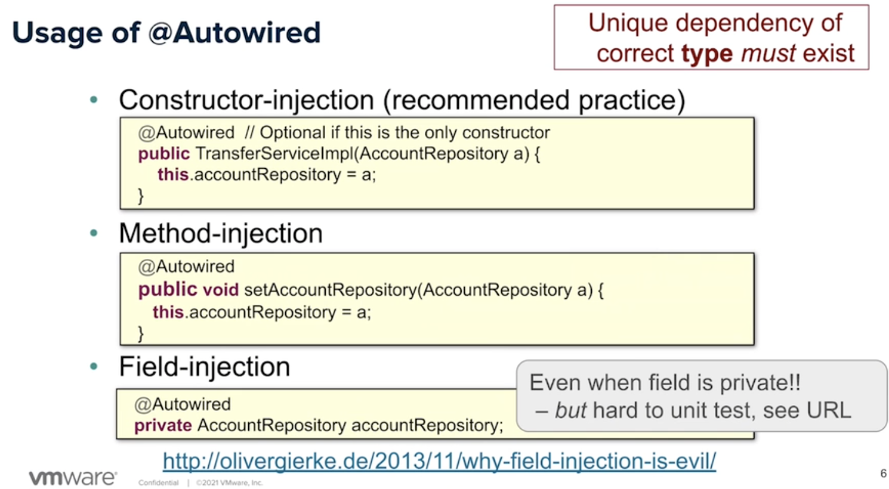

# Spring Essentials

-  The `@Configuration` annotation tells Spring to use this class to configure Spring and Spring Boot itself. Any Beans specified in this class will now be available to Spring's Auto Configuration engine. 

- After enabling Spring security, tests may fail with the error 401: Unauthorized. In order to deal with this, we need to create a bean that supplies an authenticated user to the test that invokes a secure method. Spring's IoC container will find the bean and Spring Data will use it when needed.

- Spring serves as a DI container, meaning objects created within spring context do not have to worry about connecting to each other. Spring will instantiate and inject dependencies into the objects

- Application context is the dependency container that takes care of the lifecycle of the components
- Default scope of a bean is `singleton` i.e., it will be initialized once and cached in the application context. If we compare the JVM reference, they will be the same.

- How to handle multi-threading issues
    > Use Stateless or Immutable beans 
    Use synchronized (harder) 
    Use a different scope

- Best practice to separate application and infrastracture configuration

- Spring scopes available are:
    - `singleton`:(Default) Scopes a single bean definition to a single object instance for each Spring IoC container.
    - `prototype`: Scopes a single bean definition to any number of object instances (creates a new instance any time we need it).
    - `request`: Scopes a single bean definition to the lifecycle of a single HTTP request. That is, each HTTP request has its own instance of a bean created off the back of a single bean definition. Only valid in the context of a web-aware Spring ApplicationContext.
    - `session`: Scopes a single bean definition to the lifecycle of an HTTP Session. Only valid in the context of a web-aware Spring ApplicationContext i.e. for web environment only.
    - `application`: Scopes a single bean definition to the lifecycle of a ServletContext. Only valid in the context of a web-aware Spring ApplicationContext i.e. for web environment only.
    - `websocket`: Scopes a single bean definition to the lifecycle of a WebSocket. Only valid in the context of a web-aware Spring ApplicationContext i.e. for web environment only.
    - You can also create your own scope by implementing the scope interface

- Dependency Injection Summary
    - Your object is handed with what it needs to work
        - Frees it from the burden of resolving its dependencies
        - Simplifies your code, improves code reusability
    - Promotes programming to interfaces
        - Conceals implementation details of dependencies
    - Improves testability
        - Dependencies easily stubbed out for unit testing
    - Allows for centralized control over object lifecycle
        - Opens the door for new possibilities

- Constructor injection is favored over field injection for several reasons:
    - Easier to test.
    - Safer than field injection, particularly when forcing immutability of injected members through final.
    - Ability to decouple domain POJOs from Spring.

## `Module 2: More Java Configuration`

- We create the spring application context to inject java POJO (e.g. classes) but to do so, we have to create a configuration class which tells Spring how to 
configured(their dependencies, how they should be initialized) these pojos. [Video: Spring Framework Essentials Module II - Quick start with Java Configuration]

## `Module 3: More Java Configuration`
### Using External Properties
- Spring's Environment Abstraction - 1
    - Environment bean represents loaded properties from runtime environment
    - Properties derived from various sources, in this order:
        - JVM System Properties - System.getProperty()
        - System Environment Variables - System.getenv()
        - Java Properties

- How to load properties from external environments:
    > 

- Alternatively, use `@Value` annotation instead of explicitly injecting the Environment dependency, which is already created and available in the application context
    > 

- If you have an external property file, you have to tell spring that we want to add it to the environment for it to be aware of it. This is a property source and we use the `@PropertySource` annotation
- There are 3 prefixes we can use to add external files:
    - classpath
        - get file from the classpath
        - usually located in src/main/resources e.g (classpath:/com/organization is -> src/main/resource:/com/organization)
    - file
        - allows us to define a relative or absolute path e.g. file:/config/local.properties loads a file from the file system from a relative path
    - http

### Spring Profiles
- User `@Profile` annotation

    > 
- You can activate more than 1 profiles
- Profiles are activated at runtime by
    1. using system property via command line
        > -Dspring.profiles.active=profile1,profile2
    2. using system property programmatically
        >System.setProperty("spring.profiles.active", "embedded,jpa");
        SpringApplication.run(AppConfig.class);
         
    3. `@ActiveProfiles` but can only be used in a test environment

- In the below image, the first and second will be selected because:
    1. The first does not belong to any profile and will always be initialized
    2. The second one because it belongs to the profile that has been explicitly activated
    
        > 

- We can combine `@Property` and `@PropertySource`

## Spring Expression Language (SpEL)
- 
*TODO - REVIEW AGAIN*

## `Module 4: Component Scanning`
### Annotation based configurationn
- Before, we were using explicit bean definition by defining every dependency we required:
    > 
- Now, we will use implicit configuration by using annotations. 
    > 
    > *the configuration is moved to our implementation classes (the business logic)*
- We do this by `component scanning`
    > 
    >
    >- *we add `@ComponentScan` so that our configuration class will scan the base package and look for any class indicated with `@Component`*
    >- *when found, it will be initialized and added to the application context*

#### How to make dependency injection in annotations
- Using `@Autowired` annotation which works at the constructor(recommended), method and field level
    > 
    > 
    >- *Why field injection is discouraged: http://olivergierke.de/2013/11/why-field-injection-is-evil/*

## Others
- Key features of Spring
    - DRY
    - Convention over configurationn
    - Testability
    - Separation of concerns

- Spring separates application configuration from application objects (beans)
- Spring manages your application objects by:
   - Creating them in the correct dependency order
   - Ensuring they are fully initialized before use
• Each bean is given a unique id /name when initialized

### API Contracts & JSON
- API contracts are a popular means for API providers and consumers to agree upon how an API will behave
- There are 2 types of API contracts:
    - Consumer Driven Contracts 
    - Provider Driven Contracts

API contracts communicate the behaviour or a REST API.

Operation	| API Endpoint	      |  HTTP Method  |    Response Status
Create	     | /cashcards	           |  POST	            |      201 (CREATED)
Read          | /cashcards/{id}      |  GET                  |      200 (OK)
Update      | /cashcards/{id}	   |  PUT                 |      204 (NO CONTENT)
Delete	     | /cashcards/{id}	   | DELETE           |      204 (NO CONTENT)

__Spring Security and Authentication__ 
- Authentication is the act of a Principal(user of the API) proving its identity to the system
- One way to do this is to provide credentials (e.g. a username and password using Basic Authentication). We say that once the proper credentials have been presented, the Principal is authenticated, or in other words, the user has successfully logged in.
- HTTP is a stateless protocol (requests are independent from each other), so each request must contain data that proves it’s from an authenticated Principal
- Although it’s possible to present the credentials on every request, doing so is inefficient because it requires more processing on the server. 
- Instead, an `Authentication Session` (or `Auth Session`, or just `Session`) is created when a user gets authenticated. 
- Sessions can be implemented in many ways.:
    - Session Token (a string of random characters) that is generated, and placed in a `Cookie.`  A Cookie is a set of data stored in a web client (such as a browser), and associated with a specific URI.
- A couple of nice things about Cookies:
    - Cookies are automatically sent to the server with every request (no extra code needs to be written for this to happen). As long as the server checks that the Token in the Cookie is valid, unauthenticated requests can be rejected.
    - Cookies can persist for a certain amount of time even if the web page is closed and later re-visited. This ability typically improves the user experience of the web site.
- Spring Security implements authentication in the `Filter Chain`. 
- The Filter Chain is a **component of Java web architecture which allows programmers to define a sequence of methods that get called prior to the Controller.** 
- Each filter in the chain decides whether to allow request processing to continue, or not.
- Spring Security inserts a filter which checks the user’s authentication and returns with a 401 UNAUTHORIZED response if the request is not authenticated.
- Spring Security expects a Bean to configure its Filter Chain. Annotating a method returning a SecurityFilterChain with the `@Bean` satisfies this expectation.

__Authorization__
- Authorization happens after authentication, and allows different users of the same system to have different permissions.
- Spring Security provides Authorization via `Role-Based Access Control (RBAC)`. This means that a Principal has a number of Roles. Each resource (or operation) specifies which Roles a Principal must have in order to perform actions with proper authorization.
- For example, a user with an Administrator Role is likely to be authorized to perform more actions than a user with a Card Owner Role. You can configure role-based authorization at both a global level and a per-method basis.

__Same Origin Policy__
- The web is a dangerous place, where bad actors are constantly trying to exploit security vulnerabilities. The most basic mechanism of protection relies on HTTP clients and servers implementing the Same Origin Policy (SOP). This policy states that `only scripts which are contained in a web page are allowed to send requests to the origin (URI) of the web page`.
- SOP is critical to the security of web sites because without the policy, anyone could write a web page containing a script which sends requests to any other site. For example, let’s look at a typical banking web site. If a user is logged into their bank account and visits a malicious web page (in a different browser tab or window), the malicious requests could be sent (with the Auth Cookies) to the banking site. This could result in unwanted actions–like a withdrawal from the user’s bank account!

__Cross-Origin Resource Sharing__
- Sometimes a system consists of services running on several machines with different URIs (i.e. Microservices). Cross-Origin Resource Sharing (CORS) is a way that browsers and servers can cooperate to relax the SOP. A server can explicitly allow a list of “allowed origins” of requests coming from an origin outside the servers.
- Two URLs have the same origin if the `protocol`, `port` (if specified), and `host` are the same for both.
- Spring Security provides the `@CrossOrigin` annotation, allowing you to specify a list of allowed sites. Be careful! If you use the annotation without any arguments, it will allow all origins, so bear this in mind!

__Cross-Site Request Forgery__
- Also known as `Session Riding`
- Often pronounced “Sea-Surf”
- Session riding is enabled by cookies
- CSRF attacks happen when a malicious piece of code sends a request to a server where a user is authenticated. When the server receives the Authentication Cookie, it has no way of knowing if the victim sent the harmful request unintentionally.
- We use CSRF tokens to prevent CSRF attacks.  CSRF Token is different from an Auth Token because `a unique token is generated on each request`. This makes it harder for an outside actor to insert itself into the “conversation” between the client and the server.
-  Spring Security has built-in support for CSRF tokens which is enabled by default

__Cross-Site Scripting__
- XSS occurs when an attacker is somehow able to “trick” the victim application into executing arbitrary code. There are many ways to do this. A simple example is saving a string in a database containing a `<script>` tag, and then waiting until the string is rendered on a web page, resulting in the script being executed.
- XSS is potentially more dangerous than CSRF. In CSRF, only actions that a user is authorized to do can be executed. However in XSS, arbitrary malicious code executes on the client or on the server. Additionally, XSS attacks don’t depend on Authentication. Rather, XSS attacks depend on security “holes” caused by poor programming practices
- The main way to guard against XSS attacks is to properly process all data from external sources (like web forms and URI query strings). In the case of our `<script>` tag example, ***attacks can be mitigated by properly escaping the special HTML characters when the string is rendered***.

- If you add spring-security package to a project without specifying how authentication and authorization are performed, spring security will lock everything down, including tests!!!

__Test Driven Development__
- Tests are written before implementing the application code
- TDD is ideal because we are asserting behaviour based on what we want the system to do, rather than what the system does
- TDD is also ideal because if the tests pass, we have a working application which is safeguarded from bugs by the tests

**Testing hierachy**

Unit tests
- Tests a small unit of the system isolated from the rest
- Should be simple and speedy
- Should be the primary testinng as they're key to designing highly cohesive, loosely coupled software.

Integration tests

End-to-end tests

__The Red, Green, Refactor Loop__
- Software Dev Teams move fast by continuously improving and simplifying by refactoring .
- Best time to refactor code is during the TDD cycle called the red, green refactor developmennt loop
    - Red: write a failing test
    - Green: write the simplest implementation that makes the test pass
    - Refactor: look for opportunities that improve code 

### <b> Behold Auto Configuration and Construction Injection!</b>
- Spring's Auto Configuration is utilizing its dependency injection (DI) framework, specifically constructor injection, to supply e.g, a controller with the correct implementation of e.g., a repository at runtime.
- Clues such as `NoSuchBeanDefinitionException`, `No qualifying bean,` and `expected at least 1 bean which qualifies as autowire candidate` tell us that Spring is trying to find a properly configured class to provide during the dependency injection phase of Auto Configuration, but none qualify.
- An idempotent operation is defined as one which, if performed more than once, results in the same outcome. In a REST API, an idempotent operation is one that even if it were to be performed several times, the resulting data on the server would be the same as if it had been performed only once.  
-  REST is not exactly a standard; it’s merely a way to use HTTP to perform data operations. REST contains a number of guidelines, many of which we’re following in this course.
-  An HTTP Response contains two things: a Status Code, and a Body. But that’s not all! A Response also contains Headers. Headers have a name and a value. The HTTP standard specifies that the Location header in a 201 CREATED response should contain the URI of the created resource. This is handy because it allows the caller to easily fetch the new resource using the GET endpoint (the one we implemented prior).

